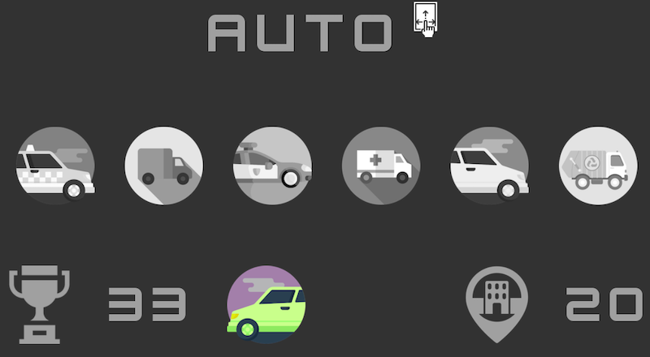
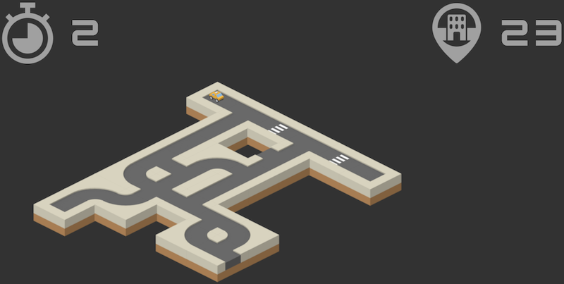
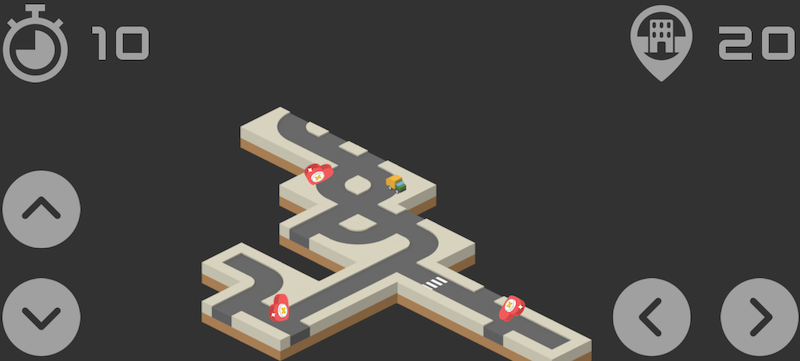

# Auto

Auto is a simple game made in [Godot](https://godotengine.org).
It's a combination of _maze_, _city explorer_ and _snake_ like games, where you have few seconds to explore the city as much as possible.
The tricky part can be steering, because you steer the car as a driver (like in RC cars). Also every second the car drives a little bit faster.

### Screenshots

### Demo

Playable demo is on _github pages_: [https://kuba--.github.io/auto/](https://kuba--.github.io/auto/)

### Credits

I could not create this game without great free assets.
- UI stuff (free icons, buttons, etc.) downloaded from [https://www.flaticon.com](https://www.flaticon.com).
- Other game assets (like fonts, car sprites and city textures) downloaded from [https://kenney.nl](https://kenney.nl).

Thank you !
